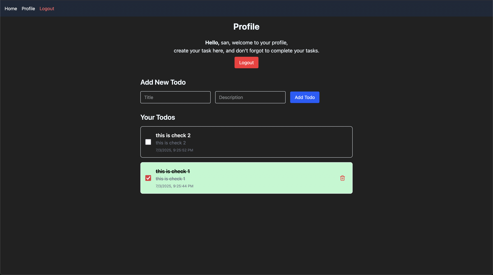

# Todo App - Full Stack Application



## Description

This is a full-stack Todo application built with modern web technologies. It features user authentication, personalized task management, and a clean, responsive interface that works across devices.

## Features

- User authentication with JWT
- Create, read, update, and delete todos
- Personalized task management
- Responsive design for all devices
- Secure data handling
- Clean and intuitive interface

## Technologies Used

### Backend
- Node.js
- Express.js
- MongoDB (with Mongoose)
- JSON Web Tokens (JWT) for authentication

### Frontend
- React.js with Vite
- Tailwind CSS for styling
- Axios for API calls

## Environment Variables

The backend requires the following environment variables in a `.env` file:

```env
PORT=3001
MONGODB_URI=your_mongodb_connection_string
JWT_SECRET=your_jwt_secret_key
```

## Project Structure

```
fullstack-todo-app/
├── frontend/          # Frontend (React + Vite + Tailwind)
│   ├── src/
│   │   ├── pages/
│   │   ├── App.jsx
│   │   └── main.jsx
│   └── vite.config.js
├── backend/          # Backend (Node.js + Express)
│   ├── config/
│   ├── controllers/
│   ├── models/
│   ├── routes/
│   ├── middleware/
│   └── server.js
|   └── .env             # Environment variables

```

## Installation

1. Clone the repository:
   ```bash
   git clone https://github.com/rimu-7/fullstack-todo-app-with-frontend-backend
   ```

2. Install backend dependencies:
   ```bash
   cd backend
   npm install
   ```

3. Install frontend dependencies:
   ```bash
   cd ..
   cd frontend
   npm install
   ```

4. Create a `.env` file in the root directory with the required environment variables.

## Running the Application

1. Start the backend server:
   ```bash
   cd backend
   npm run dev
   ```

2. Start the frontend development server:
   ```bash
   cd ..
   cd frontend
   npm run dev
   ```

The application should now be running on `http://localhost:5173` (frontend) and the backend API on `http://localhost:4500` (or your specified PORT).

## Contributing

Pull requests are welcome. For major changes, please open an issue first to discuss what you would like to change.